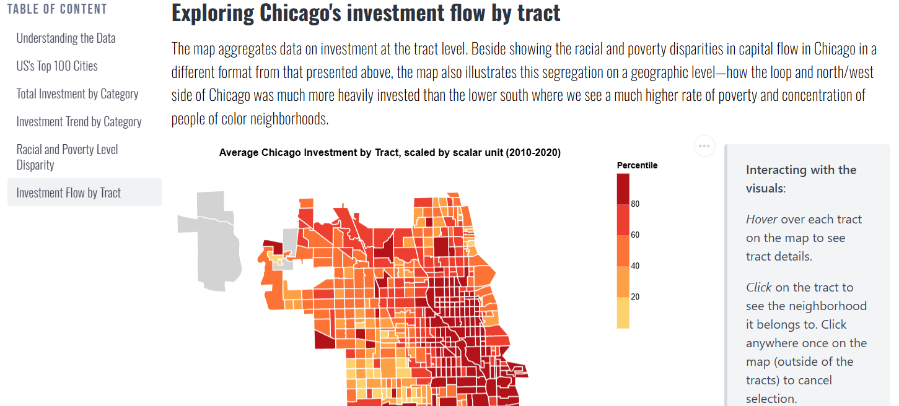

# Chicago Invest Flow
**Chicago Investment Flow Project: Where does the money go?**

CAPP 30239 Interactive Visualization Capstone Project - Minh Nghiem

## Project Description
Home to a population of 2.6 million (2023), Chicago makes itself known as the largest city in the Midwest, boasting of opportunities, diversity, and big-city glamour. However, while its reputation for high crime rate is equally matched, Chicago's deeply rooted history of segregation is much lesser known but to dwellers of the city, yet plays an important role in shaping its economic and development landscape. Using data from the Urban Institute, the article seeks to address this issue by means of presenting investment flow in different communities or neighborhoods in Chicago, thus highlighting how this plays out as the most fundamental cause to the city's persisting racial and ethnic disparities.

## Final work Preview

## How to Generate the Graphs

 Run `uv sync` in the terminal to install all necessary packages. All the graphs produced for this infographic can be replicated by running the code in `./src/graphs.ipynb`.

## Acknowledgement and Sources
**Data**

Urban Institute, [Exploring Capital Flows in Chicago](https://datacatalog.urban.org/dataset/exploring-capital-flows-chicago)

**References**

WEBEZ Chicago, [While things have improved, Chicago remains the most segregated city in America](https://www.wbez.org/race-class-communities/2023/06/19/chicago-remains-the-most-segregated-big-city-in-america)