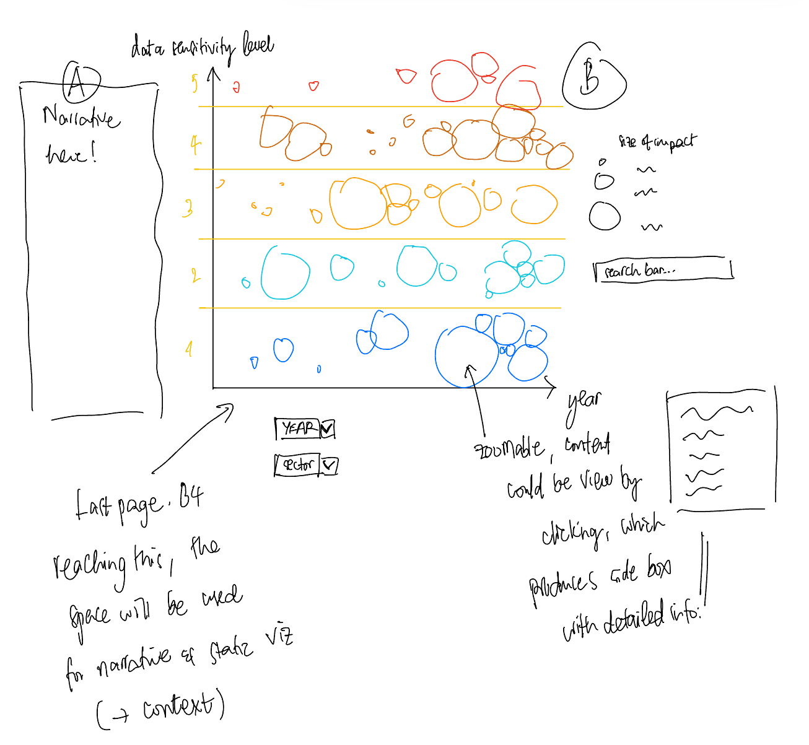

**Name**: Minh Nghiem

**Project Description**

Interactive dashboard of large-scale data breaches

Data source: https://docs.google.com/spreadsheets/d/1i0oIJJMRG-7t1GT-mr4smaTTU7988yXVz8nPlwaJ8Xk/edit?gid=2#gid=2 

The data source is a compiled list of large-scale data breach incidents from 2004-2024. An additional dataset on relevant company size is what I was looking for and thought would be nice to add, but have been unable to find one or any potential proxy for one.

Because a visualization has been done using this dataset, I'm linking the main article here as implementation will likely be built upon what has been done here with modifications: https://informationisbeautiful.net/visualizations/worlds-biggest-data-breaches-hacks/ 

I plan on incorporating xy coordinates with sorting and various filtering toggles, similar to what's achieved in this visualization (instead of year animation, I'm thinking of doing just a drop down option for year): https://www.google.com/publicdata/directory 

I'd also like to do something with a scroll functionality to help guide the narrative before ending at the one big interactive component that viewers could interact with, a bit like this one: https://pudding.cool/2024/10/abortion-mazes/ 

=> Option A is probably what I'm aiming for.

**Some concerns:**

1. I have a lot of uncertainty starting this one (already spending 4 hours looking around), as I'm not sure if Option A is something I could pull off (I have very low confidence on D3, HTML, JS, and CSS evem after all that we have seen in class). It's hard to be creative when you don't know what's within the range of possible (I may not have seen enough interactive viz to have an inspiration). That being said, the existing proposal is the "safe bet" ie something I'm settling for for now as I look more for a dataset that's more "original". Would this (getting processed data and basing the skeleton of the work on existing data viz to hopefully "improve" it with some modification and added narratives) be acceptable? Or does it have to come from an original dataset?

2. I'm having a hard time identifying dataset+topic I want to present as I can't yet figure out the narratives I want to put across (writer block equivalent?) I'll continue to try to come up with another option for your feedback asap if that's okay.

**Mockup**
